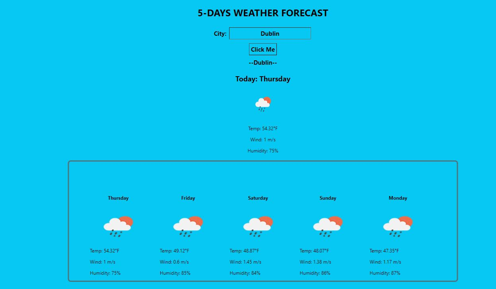

# Weather-Dashboard-app

## Descriptiom
This a weather dashboard API that run in the browser and display a 5 day weather for a choosen city.

## Table of Contents
- [Description](#Description)
- [User-Story&Acceptance-Criteria](#User-Story-&-Acceptance-Criteria)
- [Webpage-Preview](#Webpage-Preview)
- [Usage](#Usage)
- [Skill-Improved](#Skill-Improved)
- [Technologies](#Technologies)
- [Author](#Author)
- [License](#license)
- [Credits](#credits)

## User Story & Acceptance Criteria

### User Story
`AS A traveler
I WANT to see the weather outlook for multiple cities
SO THAT I can plan a trip accordingly`

### Acceptance Criteria
` GIVEN a weather dashboard with form inputs
WHEN I search for a city
THEN I am presented with current and future conditions for that city and that city is added to the search history
WHEN I view current weather conditions for that city
THEN I am presented with the city name, the date, an icon representation of weather conditions, the temperature, the humidity, and the the wind speed
WHEN I view future weather conditions for that city
THEN I am presented with a 5-day forecast that displays the date, an icon representation of weather conditions, the temperature, the wind speed, and the humidity
WHEN I click on a city in the search history
THEN I am again presented with current and future conditions for that city`

## Webpage Preview

## Usage
The link for the webpage is:https://65cd1a6ca4b3551e5d8e5579--carmenjportfolio.netlify.app/

## Skills Improved

- HTML 
- JavaScript
- CSS
- Third party API
## Technologies
- HTML 
- JavaScript
- CSS

## Author
 Carmen Jimenez : https://github.com/clcoder2425/React-Professional-Portfolio.git
 
 ## License
  

## Credits
- Open Weather: https://openweathermap.org/
- Youtube: tutorials